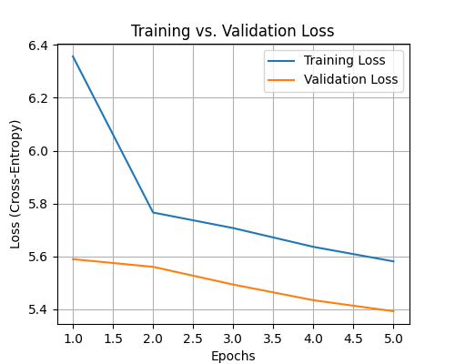
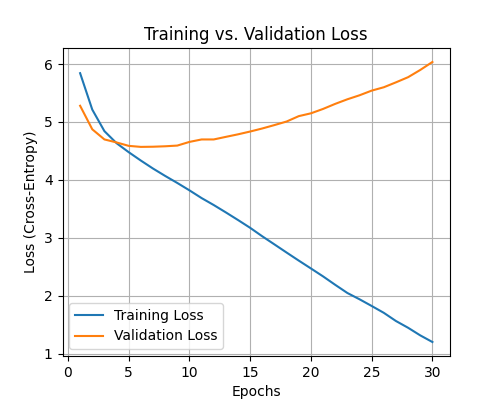

#  Neural Language Model from Scratch (PyTorch)

This project is an implementation of a neural language model from scratch using PyTorch. The model is an LSTM-based (Long Short-Term Memory) recurrent neural network trained on the "Pride and Prejudice" by Jane Austen dataset.

## 🎯 Objective
The goal is to build, train, and evaluate a sequence model to predict text. This includes implementing all data preprocessing, tokenization, and batching from scratch. The final model is evaluated using **perplexity**.

## 🏗️ Model Architecture (Best Fit)
The final model is an LSTM network with the following architecture:
| Layer | Type | Parameters |
| :--- | :--- | :--- |
| 1 | Embedding | `vocab_size` (e.g., ~7000) -> 200 dims |
| 2 | Dropout | `p=0.2` |
| 3 | LSTM | 2 Layers, 200 hidden units |
| 4 | Dropout | `p=0.2` |
| 5 | Linear (Decoder) | 200 units -> `vocab_size` |
| - | **Optimizer** | Adam (`lr=0.001`) |
| - | **Loss Function** | Cross-Entropy Loss |

## 📚 Dataset
* **Source:** "Pride and Prejudice" by Jane Austen.
* **Preprocessing:** The text is split into an 80% train, 10% validation, and 10% test set.
* **Tokenization:** A vocabulary was built from the training set. To handle the large vocabulary size, a threshold was used: words appearing 3 or more times were kept, and all other rare or unseen words were mapped to an `<unk>` (unknown) token.

## 🚀 How to Run
The entire project is contained within the `Neural_Language_Model.ipynb` file.

1.  **Environment:** This project can be run directly in Google Colab. It requires the following Python libraries:
    * `torch`
    * `numpy`
    * `matplotlib`

2.  **Run Code:** Open the `Neural_Language_Model.ipynb` file in Google Colab and run the cells in order from top to bottom.
    * The `Pride_and_Prejudice-Jane_Austen.txt` file must be uploaded to the Colab environment before running.
    * The code will automatically split the data, preprocess it, train the models, and save the final plots and model.

## 📈 Results & Analysis
The assignment required experimenting to find three models: underfit, overfit, and a best-fit model.

### 1. Underfitting
* **Parameters:** Small model (`nhid=50`, `nlayers=1`), trained for few epochs (`epochs=5`).
* **Result:** Validation Perplexity: `200.44`
* **Plot:**
    
* **Analysis:** Both training and validation losses remain high, showing the model is too simple to learn the data's patterns.

### 2. Overfitting
* **Parameters:** Large model (`nhid=400`), no dropout (`dropout=0.0`), trained for many epochs (`epochs=30`).
* **Result:** Validation Perplexity: `417.65`
* **Plot:**
    
* **Analysis:** The training loss drops, but the validation loss rises significantly. This shows the model memorized the training data and failed to generalize to new data.

### 3. Best Fit Model
* **Parameters:** Balanced model (`nhid=200`, `nlayers=2`) with regularization (`dropout=0.2`) and the `<unk>` token vocabulary.
* **Result (Validation):** Validation Perplexity: `106.95`
* **Plot:**
    
* **Analysis:** The validation loss (orange line) decreases and then plateaus, showing the "sweet spot" where the model learned to generalize without overfitting. Early stopping around epoch 10-15 would be ideal.

---

## 🏆 Final Model Performance
The `best_model.pt` file was evaluated on the held-out, unseen test set.

**Final Test Perplexity: 107.88**
